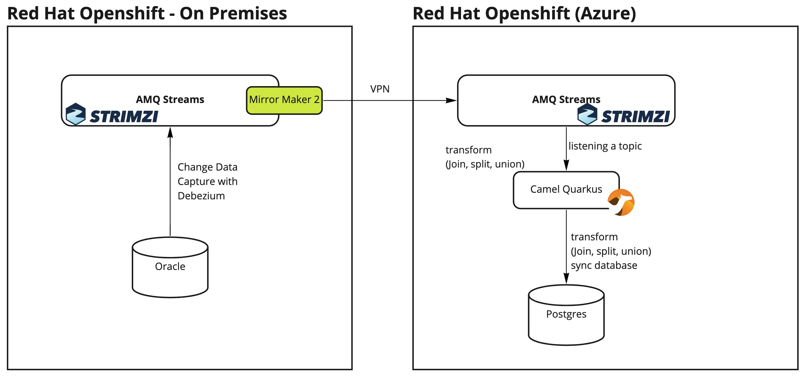

= Debezium Database Migration

== Use Case Overview

. All data from the specified table in Oracle is captured by Debezium and it's inserted in AMQ Streams as an JSON event
. The data is migrated on-premises AMQ Streams (Kafka) to Azure into another AMQ Streams cluster through Mirror Maker component.
. To acomplish the sync with Postgres a Camel application is used

== Installed Operators

. AMQ Streams
. Prometheus
. Grafana

== Install The Demo Using Ansible

=== Parameters

[options="header"]
|=======================
| Parameter | Example Value                                      | Definition
| token | sha256~vFanQbthlPKfsaldJT3bdLXIyEkd7ypO_XPygY1DNtQ | access token for a user with cluster-admin privileges
| server    | https://api.mycluster.opentlc.com:6443      | OpenShift cluster API URL
|=======================

=== Deploying the demo

    export tkn=REPLACE_ME
    export server=REPLACE_ME
    ansible-playbook -e token=${tkn} -e server=${server} playbook.yml

=== Oracle DATA

Connected to the oracle pod.

    sqlplus ot/Orcl1234@$ORACLE_PDB
    INSERT INTO ot.keys(key,value) VALUES('1234573','sample@redhat.com');
    UPDATE ot.keys SET value='sampleUpdated@redhat.com' WHERE KEY='1234573';

=== Camel-K Application

    oc create secret generic postgresqlsink --from-file application.properties
    kamel run KafkaPostgresSink.java --dev --config secret:postgresqlsink

    